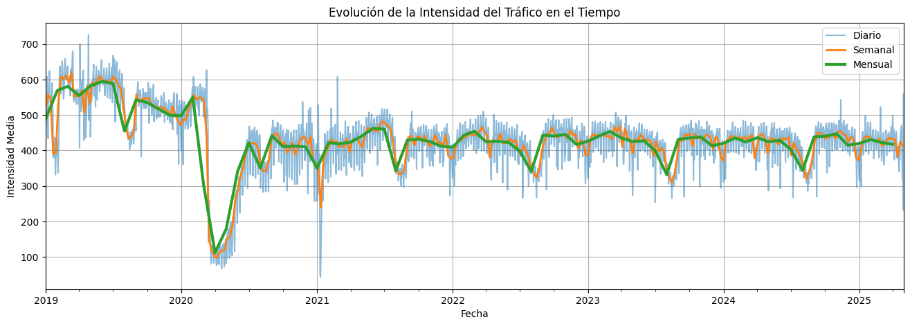

# Sistema-de-Semaforos-Inteligentes-Autónomos-para-Madrid-con-IA-y-Big-Data-TFM-10-10-
# 🚦 Sistema de Semáforos Inteligentes para Gran Vía, Madrid con IA y Big Data

Este repositorio contiene el código, análisis y documentación de nuestro **Trabajo de Fin de Máster (TFM)** en Big Data & Business Intelligence, **calificado con 10/10 (Matrícula de Honor)**. El proyecto demuestra una solución de extremo a extremo para optimizar el tráfico urbano mediante un **sistema de semáforos inteligentes autónomos** capaz de optimizar el tráfico urbano mediante **predicción de datos masivos**, **visión por computador** y un **prototipo hardware autosuficiente**.



---
## 📑 Resumen

- 📍 Caso de estudio: intersección **Gran Vía – Clavel (Madrid)**.  
- 📊 Datos: millones de registros de tráfico, aforos, meteorología y cámaras urbanas.  
- ☁️ Infraestructura: Microsoft **Azure** (Data Lake, SQL, Blobs) – actualmente inaccesible por cierre de la suscripción.  
- 🔮 Modelado: **Random Forest** con R² ≈ 0.989 y MAE ≈ 18 vehículos en el dispositivo de Gran Vía.  
- 👁️ Visión: **YOLO + OpenCV** para conteo de vehículos/peatones/Bicicletas en imágenes de cámaras urbanas.  
- 🕹️ Simulación: motor en **Python + Pygame** para reproducir intersecciones y reglas semafóricas.  
- 🔋 Hardware: prototipo con **Raspberry Pi + cámara + panel solar**.
---

## 🎯 El Problema: Congestión y Sostenibilidad en la Gran Vía

La congestión vehicular en grandes ciudades como Madrid genera retrasos, aumenta el consumo de combustible y eleva las emisiones de CO₂.
Los semáforos tradicionales, con sus sistemas obsoletos y tiempos fijos, son ineficientes para gestionar la dinámica del tráfico en tiempo real.

Nuestro objetivo fue diseñar y validar un **sistema de semáforos autónomos** que se adapte dinámicamente al flujo de vehículos y peatones, enfocado en la intersección más crítica y congestionada de la ciudad: **Gran Vía – Clavel**.

---

## 🛠️ Stack Tecnológico

- **Análisis y Modelado:** Python (Pandas, Scikit-learn, Matplotlib, Seaborn).
- **Visión por Computador:** YOLO, OpenCV
- **Simulación:** Pygame 
- **Infraestructura de Datos (Original):** Microsoft Azure (SQL Database, Blob Storage)
- **Hardware (Prototipo):** Raspberry Pi, Paneles Solares.

---

## 📂 Estructura del Repositorio

TFM-Semaforo-Inteligente/
├─ README.md
├─ LICENSE
├─ docs/
│ ├─ TFM_oficial.pdf <- versión entregada a la universidad
│ └─ figures/ <- imágenes y gráficas clave
├─ data/
│ └─ sample_granvia.csv <- muestra anonima de datos
├─ notebooks/
│ ├─ 01_preprocessing.ipynb
│ ├─ 02_eda.ipynb
│ └─ 03_modeling_random_forest.ipynb
├─ src/
│ ├─ etl/
│ │ └─ etl_sample.py
│ ├─ vision/
│ │ └─ detect_and_count.py
│ ├─ simulation/
│ │ └─ pygame_sim.py
│ └─ models/
│ └─ rf_pipeline.py
├─ results/
│ ├─ model_metrics.txt
│ └─ visualizations.png
├─ requirements.txt
└─ CONTRIBUTING.md

---

## 📊 Flujo del Proyecto y Análisis

### 1. **Ingeniería de Datos y Análisis Exploratorio (EDA)**
Se recopilaron y procesaron **millones de registros** de diversas fuentes del Ayuntamiento de Madrid. El análisis reveló patrones horarios y diarios claros en el tráfico vehicular y peatonal, así como "puntos calientes" de accidentalidad.
NOTA: Ausencia de datos en la época de la Pandemia Covid-19, se trataron con modelados y predicciones de ML.

  (INSERTAR)

*Análisis detallado en el notebook: [`01_EDA_y_Preprocesamiento.ipynb`](./notebooks/01_EDA_y_Preprocesamiento.ipynb)*

### 2. **Modelado Predictivo con Random Forest**
Entrenamos un modelo para predecir la intensidad del tráfico (`vehículos/hora`) basándonos en variables como la Intensidad, carga y la ocupación de la vía. 
El modelo se entrenó por dispositivo para capturar las características únicas de cada punto de medición.

*Resultados y código en el notebook: [`02_Modelado_Predictivo_RandomForest.ipynb`](./notebooks/02_Modelado_Predictivo_RandomForest.ipynb)*

### 3. **Visión por Computador con YOLO**
Utilizamos un modelo YOLO para detectar y contar vehículos y peatones en tiempo real a partir de imágenes de las cámaras de tráfico de Madrid. 
Este módulo proporciona los datos de entrada para la lógica de decisión del semáforo.


*Implementación y pruebas en: [`03_Deteccion_de_Objetos_con_YOLO.ipynb`](./notebooks/03_Deteccion_de_Objetos_con_YOLO.ipynb)*

### 4. **Simulación y Prototipo Hardware**
Para validar la lógica del sistema, adaptamos un motor de simulación en Pygame. Además, se diseñó y calculó la viabilidad de un prototipo físico autónomo basado en una Raspberry Pi y un panel solar, con un consumo estimado de ~15W, garantizando su funcionamiento incluso durante apagones.

---

## 📈 Resultados Principales

- **Modelo Predictivo de Alta Precisión:** Se obtuvo un **R² de 0.989** y un MAE de solo 18.5 vehículos en el dispositivo de prueba de Gran Vía.
- **Identificación de Variables Clave:** La `Intensidad` de la vía demostró ser la variable más predictiva, con una importancia del 95% en el modelo.
- **Viabilidad de la Autonomía Energética:** Un panel solar de 80W es suficiente para alimentar el sistema y una batería de 560Wh proporciona una autonomía de ~1.5 días sin sol.
- **Impacto Ambiental Cuantificable:** Se estima que una reducción de 5 minutos de espera en semáforos podría **ahorrar 150 toneladas de CO₂ diarias** en una ciudad como Madrid.

---

## 💡 Desafíos y Lecciones Aprendidas

- **Gestión de Datos a Escala:** El manejo de archivos CSV cada uno de ~800MB o 1’150,000,000 registros por mes requirió optimizar los procesos de ETL y filtrar los datos de manera inteligente para el análisis.
- **Limitaciones de la Visión por Computador:** La precisión del modelo YOLO se ve afectada por condiciones climáticas adversas como la lluvia intensa y los reflejos solares, un factor a considerar para un despliegue real. Asímismo la detección erronea de Peatones con objetos antropomorfos e imágenes de gigantografías.
- **Multicolinealidad:** Se detectó una alta correlación entre variables de tráfico (`carga`, `ocupación`,`nivel de servicio`, ìntensidad`), lo que requirió un análisis cuidadoso para la selección de características del modelo.

---

## ▶️ Cómo Reproducir este Análisis

> **Nota IMPORTANTE:** Este proyecto utiliza solo un conjunto de datos de muestra para la reproducibilidad. El análisis original se realizó en un entorno de Big Data en Microsoft Azure.

1.  **Clona el repositorio:**
    ```bash
    git clone [https://github.com/](https://github.com/)<tu_usuario>/TFM-Semaforo-Inteligente.git
    cd TFM-Semaforo-Inteligente
    ```
2.  **Crea un entorno virtual e instala las dependencias:**
    ```bash
    python -m venv venv
    source venv/bin/activate  # En Windows: venv\Scripts\activate
    pip install -r requirements.txt
    ```
3.  **Ejecuta los notebooks:**
    Inicia Jupyter Lab o Jupyter Notebook y explora la carpeta `/notebooks/`.

---

## 👨‍🎓 Autores

- **Esmeralda Arribas Calderón**
- **Gisela María Gpe Bernal Ávila**
- **Judeh Samir Saba Ibarra**

Trabajo de Fin de Máster en Big Data & Business Intelligence.
*Director: Belarmino García | Tutor: Miguel Couto*


